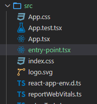
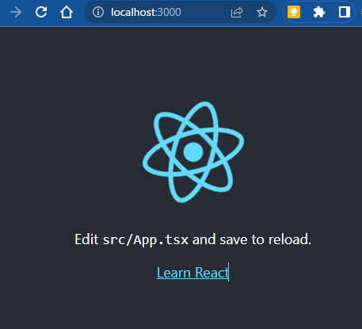

# Reactの実行開始ファイル「index.tsx」の名前を変更してみる

## はじめに
create-react-appでテンプレートを作成した場合、エントリーポイントは`index.tsx`固定になっています。
ふと、このファイル名を変更するにはどうすればいいか？気になったので実験してみました。

eject('npm run eject')を実行すると、隠されていた設定ファイルとビルドスクリプトが出力されます。

その中に`config\paths.js`というファイルがあり、各種パスが定義されていました。
`appIndexJs`を書き換えれば目的が達成できそうです。

ただ、ejectすると後が大変ですので[react-app-rewired](https://www.npmjs.com/package/react-app-rewired)を使って書き換えてみます。


```js
// config after eject: we're in ./config/
module.exports = {
  dotenv: resolveApp('.env'),
  appPath: resolveApp('.'),
  appBuild: resolveApp(buildPath),
  appPublic: resolveApp('public'),
  appHtml: resolveApp('public/index.html'),
  appIndexJs: resolveModule(resolveApp, 'src/index'),
  appPackageJson: resolveApp('package.json'),
  appSrc: resolveApp('src'),
  appTsConfig: resolveApp('tsconfig.json'),
  appJsConfig: resolveApp('jsconfig.json'),
  yarnLockFile: resolveApp('yarn.lock'),
  testsSetup: resolveModule(resolveApp, 'src/setupTests'),
  proxySetup: resolveApp('src/setupProxy.js'),
  appNodeModules: resolveApp('node_modules'),
  appWebpackCache: resolveApp('node_modules/.cache'),
  appTsBuildInfoFile: resolveApp('node_modules/.cache/tsconfig.tsbuildinfo'),
  swSrc: resolveModule(resolveApp, 'src/service-worker'),
  publicUrlOrPath,
};
```


## 前提

create-react-appで作成したプログラム(--template typescript)

## 手順

① package.jsonの`devDependencies`に`react-app-rewired`を追加

```sh
  npm i -D react-app-rewired
```

② ビルドの設定変更を行うため`config-overrides.js`をルートフォルダに作成

`paths.appIndexJs`の設定を上書きします。

```js
const path = require('path');
module.exports = {
  paths: function (paths, env) {
    paths.appIndexJs = path.resolve(__dirname, 'src/entry-point.tsx');
    return paths;
  },
};
```

③ package.jsonを修正

```json
  "scripts": {
-    "start": "react-scripts start",
-    "build": "react-scripts build",
+    "start": "react-app-rewired start",
+    "build": "react-app-rewired build",
    "test": "react-scripts test",
    "eject": "react-scripts eject"
  }
```

④ `index.tsx`を`entry-point.tsx`にリネーム

```sh
mv index.tsx entry-point.tsx
```



⑤ 動作確認

```sh
npm run start
```
いつもの画面が表示されました




## 参考ページ
[react-app-rewired](https://www.npmjs.com/package/react-app-rewired)には`path`だけではなく、`webpack, jest, devServer`の書き換え方の説明が乗っています。

